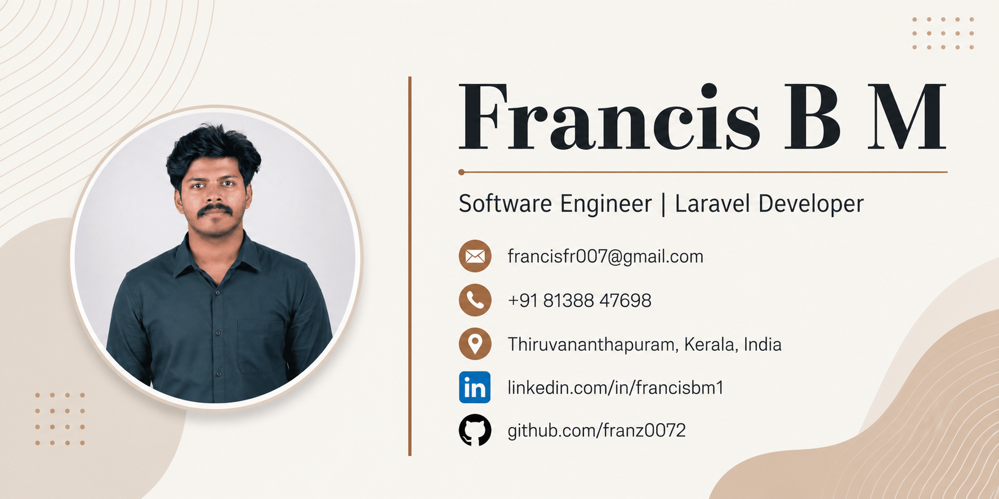

  

<h1 align="center">Hi 👋, I'm Francis B M</h1>

<h3 align="center">
Laravel Backend Developer | PHP | MySQL | REST APIs | AWS
</h3>

I'm a Laravel Backend Developer from Kerala, India, with 2+ years of experience building scalable web applications, REST APIs, and business solutions. I enjoy solving backend challenges and continuously learning modern technologies like React, Tailwind CSS, and AWS.

  

---

# 👨‍💻 About Me

- 💼 Software Engineer at **Hiworth Solutions Pvt Ltd**
- 🚀 2+ years of experience in **Laravel, PHP & MySQL**
- 📱 Developing REST APIs for Flutter and Web Applications
- ☁️ Experience deploying Laravel applications on AWS
- 🌱 Currently learning **React, Tailwind CSS, TypeScript & DSA**
- 🎯 Goal: Become a Senior Laravel / Full Stack Developer

---

# 🛠 Tech Stack

### Backend

### Database

### Frontend

### Tools

---

# 🚀 Professional Experience

### 🦌 CAZA – Hunting Platform

Worked as a Backend Developer on a production Laravel application.

**Key Contributions**

- Developed REST APIs for Flutter applications
- Hunt booking and management system
- Stripe payment integration
- Push notifications
- Google Maps integration
- User authentication & authorization
- MySQL database design and optimization

### 💼 Other Professional Projects

- MaddParts (Bagisto E-commerce)
- Blessed Sacrament (PyroCMS → Laravel Migration)
- Osceola Housing Authority (CMS Migration)
- The Land App (Map-based Application)

> *Contributed to backend development, feature implementation, API development, and system maintenance.*

---

# 🚀 Currently Building

- SaaS Project Management System
- Personal Portfolio using React + TypeScript
- Learning React, Tailwind CSS & AWS

---

# 📊 GitHub Statistics

  

  

  

---

# 🌐 Portfolio

**Portfolio Website**

> Coming Soon (Vercel)

---

# 📫 Connect With Me

---

## 📧 Contact

**📧 Email:** francisfr007@gmail.com

**💼 LinkedIn:** https://www.linkedin.com/in/francisbm1

**💻 GitHub:** https://github.com/franz0072

---

⭐ *Thanks for visiting my profile! Feel free to explore my repositories and connect with me.*